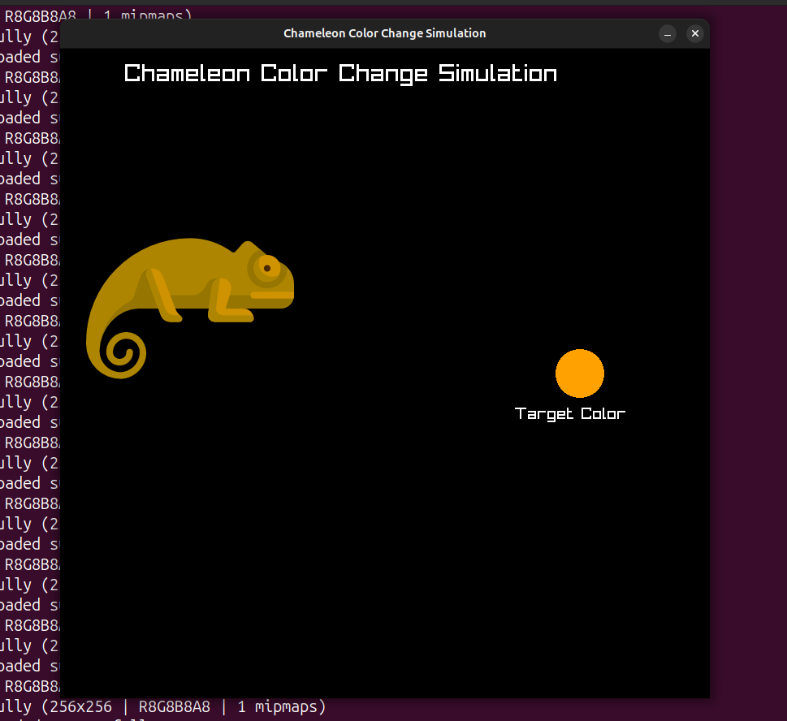

## Chameleon Color Change Simulation using PID

 - This is a simple program written in C with the raylib library
 - The program mimicks the color change ability of chameleons in different environments
    
  ### OBJECTS
  - The two main objects in this project are the chameleon and the target environment color (represented by a
    polygon). The goal is simple, the chameleon sees this objects and tries to mimick its color change regardless
    of what color it is. This color change logic is gradually achieved using PID Control.

  ### HOW IT WORKS
    - Primary colors (Red, Green, Blue) make up all other colors. Different proportions of these primary
    colors combine to make new colors ranging from 0 to 255. So using the PID algorithm, the chameleon learns how to set
    correct values to get the target color.
    - The CLITERAL (Color) utility in c [raylib] makes it easier to manipulate the individual components of these colors
    to achieve this color changing effect while running in a loop.
    - In effect, both the Chameleon's color and the target color are CLITERAL Color values.

  ### ARGS
    - You can pass some arguments to the make command to influence the color change behaviour.
    - make ARGS="output" --> (print the output of the controller process, shows the Chameleon's current RGB values to the Target RGB value)
    - make ARGS="motion" --> (By default, the chameleon is static. Passing this argument enables the chameleon to move about while still changing its color)

  ## PSEUDO COMPUTATION
    - Computation flow (considering the Red component):
                    Proportional = (TargetColor.Red - CurrentChameleonColor.Red)
                    Integral += Proportional * frameTime; [GetFrameTime()]
                    Derivative = (Proportional - PreviousProportionalError) / frameTime;
    - This computation runs in a loop until there is a minimal absolute difference between the target color and the chameleon's color.

  ## PID VALUES
    - With some experimentation I realized that these constants work quite well
    - KP = 0.66
    - KI = 0.039
    - KD = 0.0029

  ## SCREENSHOT DEMO
    - 

  ## MORE TO COME
    - I'm looking forward to using neural networks to obtain parameters for the target environment color with high 
      accuracy. 
